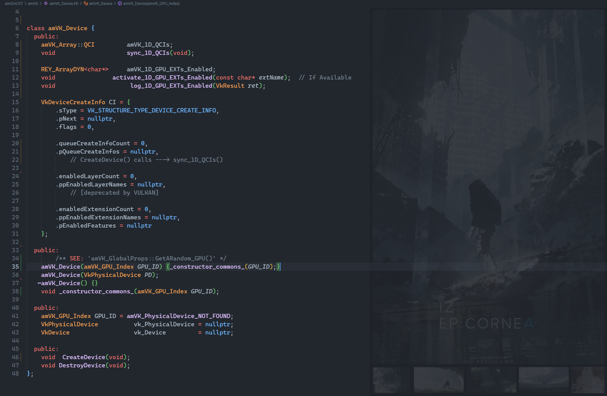

## Read the [`./guide/4.guide.md`](https://github.com/REYNEP/amGHOST/blob/main/amVK/guide/4.guide.md)

## `amVK_Class`

2560x1200px
made with affine.pro


## `Files Table`

<table width="100%" border="1">
<tr>
<td width="50%">
</br>

- 🗂️ `common`
    - 📝 [amVK.hh](https://github.com/REYNEP/amGHOST/blob/main/amVK/common/amVK.hh)
    - 📝 [amVK_GPU.hh](https://github.com/REYNEP/amGHOST/blob/main/amVK/common/amVK_GPU.hh)
    - 📝 [amVK_RenderPass_Descriptors.hh](https://github.com/REYNEP/amGHOST/blob/main/amVK/common/amVK_RenderPass_Descriptors.hh)
    - 📝 [amVK_log.cpp](https://github.com/REYNEP/amGHOST/blob/main/amVK/common/amVK_log.cpp)
    - 📝 [amVK_log.hh](https://github.com/REYNEP/amGHOST/blob/main/amVK/common/amVK_log.hh)

- 🗂️ `core`
    - 📝 [amVK_CommandPool.hh](https://github.com/REYNEP/amGHOST/blob/main/amVK/core/amVK_CommandPool.hh)
    - 📝 [amVK_Device.cpp](https://github.com/REYNEP/amGHOST/blob/main/amVK/core/amVK_Device.cpp)
    - 📝 [amVK_Device.hh](https://github.com/REYNEP/amGHOST/blob/main/amVK/core/amVK_Device.hh)
    - 📝 [amVK_DeviceOCL.hh](https://github.com/REYNEP/amGHOST/blob/main/amVK/core/amVK_DeviceOCL.hh)
    - 📝 [amVK_Instance.cpp](https://github.com/REYNEP/amGHOST/blob/main/amVK/core/amVK_Instance.cpp)
    - 📝 [amVK_Instance.hh](https://github.com/REYNEP/amGHOST/blob/main/amVK/core/amVK_Instance.hh)
    - 📝 [amVK_InstancePropsEXT.hh](https://github.com/REYNEP/amGHOST/blob/main/amVK/core/amVK_InstancePropsEXT.hh)
    - 📝 [amVK_Pipeline.hh](https://github.com/REYNEP/amGHOST/blob/main/amVK/core/amVK_Pipeline.hh)
    - 📝 [amVK_RenderPass.cpp](https://github.com/REYNEP/amGHOST/blob/main/amVK/core/amVK_RenderPass.cpp)
    - 📝 [amVK_RenderPass.hh](https://github.com/REYNEP/amGHOST/blob/main/amVK/core/amVK_RenderPass.hh)
    - 📝 [amVK_RenderPassCMDs.hh](https://github.com/REYNEP/amGHOST/blob/main/amVK/core/amVK_RenderPassCMDs.hh)
    - 📝 [amVK_RenderPassFBs.hh](https://github.com/REYNEP/amGHOST/blob/main/amVK/core/amVK_RenderPassFBs.hh)
    - 📝 [amVK_Surface.cpp](https://github.com/REYNEP/amGHOST/blob/main/amVK/core/amVK_Surface.cpp)
    - 📝 [amVK_Surface.hh](https://github.com/REYNEP/amGHOST/blob/main/amVK/core/amVK_Surface.hh)
    - 📝 [amVK_SwapChain.cpp](https://github.com/REYNEP/amGHOST/blob/main/amVK/core/amVK_SwapChain.cpp)
    - 📝 [amVK_SwapChain.hh](https://github.com/REYNEP/amGHOST/blob/main/amVK/core/amVK_SwapChain.hh)
    - 📝 [amVK_SwapChainIMGs.hh](https://github.com/REYNEP/amGHOST/blob/main/amVK/core/amVK_SwapChainIMGs.hh)
    </br> 
- 📝 [amVK_SurfacePresenter.hh](https://github.com/REYNEP/amGHOST/blob/main/amVK/amVK_SurfacePresenter.hh)

</br>
</td>
<td width="50%">

- 🗂️ `extras`
    - 📝 [amVK_CommandBuffer.hh](https://github.com/REYNEP/amGHOST/blob/main/amVK/extras/amVK_CommandBuffer.hh)
    - 📝 [amVK_FrameBuffer.hh](https://github.com/REYNEP/amGHOST/blob/main/amVK/extras/amVK_FrameBuffer.hh)
    - 📝 [amVK_Image.hh](https://github.com/REYNEP/amGHOST/blob/main/amVK/extras/amVK_Image.hh)
    - 📝 [amVK_SemaPhone.hh](https://github.com/REYNEP/amGHOST/blob/main/amVK/extras/amVK_SemaPhone.hh)
    - 📝 [SCREENSHOT_STUDIO.hh](https://github.com/REYNEP/amGHOST/blob/main/amVK/extras/SCREENSHOT_STUDIO.hh)

- 🗂️ `impl`
    - 📝 [amVK_SurfacePresenter.cpp](https://github.com/REYNEP/amGHOST/blob/main/amVK/impl/amVK_SurfacePresenter.cpp)
    - 📝 [amVK_SurfacePresenter.hh](https://github.com/REYNEP/amGHOST/blob/main/amVK/impl/amVK_SurfacePresenter.hh)

- 🗂️ `mesh`
    - 📝 [amVK_Vertex.hh](https://github.com/REYNEP/amGHOST/blob/main/amVK/mesh/amVK_Vertex.hh)
    - 📝 [amVK_VertexBuffer.cpp](https://github.com/REYNEP/amGHOST/blob/main/amVK/mesh/amVK_VertexBuffer.cpp)
    - 📝 [amVK_VertexBuffer.hh](https://github.com/REYNEP/amGHOST/blob/main/amVK/mesh/amVK_VertexBuffer.hh)

- 🗂️ `utils`
    - 📝 [amVK_Enum2String.cpp](https://github.com/REYNEP/amGHOST/blob/main/amVK/utils/amVK_Enum2String.cpp)
    - 📝 [amVK_Enum2String.hh](https://github.com/REYNEP/amGHOST/blob/main/amVK/utils/amVK_Enum2String.hh)
    - 📝 [amVK_GPUProps.cpp](https://github.com/REYNEP/amGHOST/blob/main/amVK/utils/amVK_GPUProps.cpp)
    - 📝 [amVK_GPUProps.hh](https://github.com/REYNEP/amGHOST/blob/main/amVK/utils/amVK_GPUProps.hh)
    - 📝 [amVK_InstanceProps_OLD.hh](https://github.com/REYNEP/amGHOST/blob/main/amVK/utils/amVK_InstanceProps_OLD.hh)
    - 📝 [amVK_InstanceProps.cpp](https://github.com/REYNEP/amGHOST/blob/main/amVK/utils/amVK_InstanceProps.cpp)
    - 📝 [amVK_InstanceProps.hh](https://github.com/REYNEP/amGHOST/blob/main/amVK/utils/amVK_InstanceProps.hh)
    - 📝 [amVK_InstancePropsExport_nlohmann.cpp](https://github.com/REYNEP/amGHOST/blob/main/amVK/utils/amVK_InstancePropsExport_nlohmann.cpp)
    - 📝 [amVK_InstancePropsExport_yyson_ryml.cpp](https://github.com/REYNEP/amGHOST/blob/main/amVK/utils/amVK_InstancePropsExport_yyson_ryml.cpp)
    - 📝 [amVK_nlohmann.hh](https://github.com/REYNEP/amGHOST/blob/main/amVK/utils/amVK_nlohmann.hh)

</td>
</tr>
</table>

## `Flow / Directions / Guide`
- WIP
1. `amVK_Instance.hh`
2. `amVK_GPU.hh`
3. `amVK_InstanceProps.hh`
4. `REY_Utils.hh` ---> `REY_Array` & `REY_ArrayDYN`
5. `amVK_Device.hh`
6. `amVK_DeviceQCI.hh`
7. `amVK_Surface.hh`
8. `amVK_SwapChain.hh`
9. `amVK_ColorSpace.hh`
10. `amVK_SwapChainIMGs.hh`
11. `amVK_RenderPass.hh`
12. `amVK_RenderPass_Descriptors.hh`
13. `amVK_RenderPassFBs.hh`
14. `amVK_CommandPool.hh`
15. `amVK_RenderPassCMDs.hh`

## amVK vs amGHOST
- This is a little bit different than `amGHOST`. 
    - `amGHOST`:- Window & Such objects are instanced from `amG_HEART->new_window_interface()` and such and such. 
    - `amVK`:- but in, `amVK`, you rather gotta do `amVK_Device *D = new amVK_Device();` 
        - -> i.e. you can just create the object yourself.
1. `naming convention`:- different
2. `amGHOST_System` === `amVK_Instance`
3. `amGHOST`:- object types are `pure virtual`
    - which means that you cannot _**'instantiate'**_ these `pure virtual` classes directly.... 
        - but rather take instance of `derived classes` that implements those `pure virtual functions`. 
        - this idea is also called `interface`
    - `amVK` doesn't have that problem, 
        - cz there's nothing to me made _**"platform independent"**_

## Example
```cpp
#include "amGHOST_System.hh"

#include "amVK_InstancePropsEXT.hh"
#include "amVK_Instance.hh"
#include "amVK_Device.hh"
#include "amVK_DeviceQueues.hh"

#include "amGHOST_VkSurfaceKHR.hh"
#include "amVK_Surface.hh"

#include "amVK_SurfacePresenter.hh"

#include "amVK_SwapChain.hh"
#include "amVK_ColorSpace.hh"
#include "amVK_RenderPass.hh"
#include "amVK_RenderPass_Descriptors.hh"
#include "amVK_CommandPoolMAN.hh"

#include "mesh/amVK_Vertex.hh"
#include "mesh/amVK_VertexBuffer.hh"

#include "amVK_PipelineGRAPHICS.hh"

int main(int argumentCount, char* argumentVector[]) {
    REY::cout << "\n";

    amGHOST_System::create_system();

    amGHOST_Window *W = amGHOST_System::heart->new_window_interface();
    W->create(L"Whatever", 0, 0, 500, 600);


    REY_LOG("");
    REY_LOG("");
    amVK_SurfacePresenter  *PR = new amVK_SurfacePresenter();
    // TwT
    {
            REY_LOG("");
        amVK_InstanceProps::EnumerateInstanceExtensions();
        amVK_InstanceProps::EnumerateInstanceLayerProperties();
        amVK_Instance::addTo_1D_Instance_Layers_Enabled("VK_LAYER_KHRONOS_validation");
        amVK_Instance::addTo_1D_Instance_EXTs_Enabled("VK_KHR_surface");
        amVK_Instance::addTo_1D_Instance_EXTs_Enabled(amGHOST_System::get_vulkan_os_surface_ext_name());
        amVK_Instance::CreateInstance();    // initializes amVK_HEART


            REY_LOG("");
        VkSurfaceKHR  VK_S = amGHOST_VkSurfaceKHR::create_surface(W, amVK_Instance::vk_Instance);


            REY_LOG("");
        amVK_InstancePropsEXT::EnumeratePhysicalDevices();
        amVK_GPUProps  *GPUProps = amVK_InstancePropsEXT::GetARandom_GPU();
                        GPUProps->GetPhysicalDeviceQueueFamilyProperties();
                        GPUProps->EnumerateDeviceExtensionProperties();
                        GPUProps->REY_CategorizeQueueFamilies();

        amVK_Device* D = new amVK_Device(GPUProps);
            D->addTo_1D_GPU_EXTs_Enabled("VK_KHR_swapchain");
            D->CreateDevice(1);
            D->GetDeviceQueues();

        
            REY_LOG("")
        amVK_Surface   *S  = new amVK_Surface(VK_S);
            S->GetPhysicalDeviceSurfaceInfo();
            S->GetPhysicalDeviceSurfaceCapabilitiesKHR();
        // amVK_SurfacePresenter   *PR = new amVK_SurfacePresenter();
                                    PR->bind_Surface(S);
                                    PR->bind_Device(D);
                                    PR->create_SwapChain_interface();       // This amVK_SwapChain is Bound to this amVK_Surface
            
            REY_LOG("")
        amVK_SwapChain *SC =    PR->SC;
            SC->konf_ImageSharingMode(VK_SHARING_MODE_EXCLUSIVE);
            SC->konf_Images(
                amVK_IF::RGBA_8bpc_UNORM,   // VK_FORMAT_R8G8B8A8_UNORM
                amVK_CS::sRGB,              // VK_COLOR_SPACE_SRGB_NONLINEAR_KHR
                amVK_IU::Color_Display      // VK_IMAGE_USAGE_COLOR_ATTACHMENT_BIT
            );
            SC->konf_Compositing(
                amVK_PM::FIFO,              // VK_PRESENT_MODE_FIFO_KHR
                amVK_CC::YES,               // Clipping:- VK_TRUE
                amVK_TA::Opaque             // VK_COMPOSITE_ALPHA_OPAQUE_BIT_KHR
            );
            SC->sync_SurfCaps();            // refresh/fetch & set/sync ---> latest SurfCaps

            SC->CI.oldSwapchain     = nullptr;
            SC->CreateSwapChain();

        amVK_SwapChainIMGs *SC_IMGs = PR->create_SwapChainImages_interface();
            SC_IMGs->   GetSwapChainImagesKHR();
            SC_IMGs->CreateSwapChainImageViews();

        amVK_RenderPass *RP = PR->create_RenderPass_interface();
            amVK_RPADes::ColorPresentation.format = SC->CI.imageFormat;

            RP->AttachmentInfos.push_back(amVK_RPADes::ColorPresentation);
            RP->SubpassInfos   .push_back(amVK_RPSDes::ColorPresentation);
            RP->Dependencies   .push_back(amVK_RPSDep::ColorPresentation);

            RP->sync_Attachments_Subpasses_Dependencies();
            RP->CreateRenderPass();

        amVK_RenderPassFBs *RP_FBs = PR->create_FrameBuffers_interface();
            RP_FBs->CreateFrameBuffers();

        amVK_CommandPoolMAN  *CPMAN = PR->create_CommandPoolMAN_interface();
            amVK_CommandPool *CP = CPMAN->InitializeCommandPool(D->Queues.Used_QFamID.Graphics);
                CP->CreateCommandPool(amVK_Sync::CommandPoolCreateFlagBits::RecordBuffer_Once);
                CP->AllocateCommandBuffers();

        // ------------------------- Pipeline & VkTriangle ----------------------------
            amVK_Vertex vertices[3] = {
                { {  0.00f,  0.25f, 0.0f }, { 1.0f, 0.0f, 0.0f, 1.0f } },   // v0 (red)
                { { -0.25f, -0.25f, 0.0f }, { 0.0f, 1.0f, 0.0f, 1.0f } },   // v1 (green)
                { {  0.25f, -0.25f, 0.0f }, { 0.0f, 0.0f, 1.0f, 1.0f } },   // v2 (blue)
            };
            amVK_VertexBuffer VB(D, REY_Array<amVK_Vertex>(vertices, 3));
                VB.CreateBuffer();

            GPUProps->GetPhysicalDeviceFeatures();
            GPUProps->GetPhysicalDeviceMemoryProperties();
            GPUProps->REY_CategorizeMemoryHeaps();

                VB.GetBufferMemoryRequirements();
                VB.AllocateMemory();
                VB.MapMemory();
                VB.CopyIntoMemory();
                VB.UnMapMemory();
                VB.BindBufferMemory();

            amVK_PipelineGRAPHICS* PLG = new amVK_PipelineGRAPHICS(RP_FBs);
                PLG->CreateGraphicsPipeline();
        // ------------------------- Pipeline & VkTriangle ----------------------------
        
        // ------------------------- CommandBufferRecording ----------------------------
            VkCommandBuffer CB = CP->BeginCommandBuffer();
                RP_FBs->RPBI_AcquireNextFrameBuffer();
                RP_FBs->CMDBeginRenderPass(CB);
                RP_FBs->CMDSetViewport_n_Scissor(CB);
                PLG->CMDBindPipeline(CB);
                    VB.CMDBindVertexBuffers(CB);
                    VB.CMDDraw(CB);
                RP_FBs->CMDEndRenderPass(CB);
            CP->  EndCommandBuffer();

        // ------------------------- CommandBufferRecording ----------------------------
        
        // ------------------------- Render Loop ----------------------------
            while(true) {
                PR->set_CommandPool_Presentation(CP);
                PR->submit_CMDBUF(D->Queues.GraphicsQ(0));
                PR->Present(D->Queues.GraphicsQ(0));

                vkQueueWaitIdle(D->Queues.GraphicsQ(0));
                RP_FBs->RPBI_AcquireNextFrameBuffer();

                REY::cin.get();
            }
        // ------------------------- Render Loop ----------------------------
    }
    REY_LOG("");
    REY_LOG("");


    REY::cin.get();     // wait for terminal input
        amVK_InstancePropsEXT::Export_nilohmannJSON_EXT();
        PR->destroy_everything_serially();
        W->m_amGHOST_VkSurface->destroy();
        amVK_Instance::DestroyInstance();
    W->destroy();

    REY::cout << "\n";
}
```

## Naming Conventions
1. Simple Wrappers around `vulkan` functions
    ```cpp
    bool called_GetPhysicalDeviceSurfaceFormatsKHR = false;
    bool called_GetPhysicalDeviceSurfaceCapabilitiesKHR = false;
    void        GetPhysicalDeviceSurfaceInfo(void);
    void        GetPhysicalDeviceSurfaceCapabilitiesKHR(void);

    amVK_SwapChain {
            // Notice the "Capital-C" @ 'Chain', i didn't do this at any other functions
        void CreateSwapChain(void) {
            VkResult return_code = vkCreateSwapchainKHR(this->D->m_device, &CI, nullptr, &this->SC);
            amVK_return_code_log( "vkCreateSwapchainKHR()" );     // above variable "return_code" can't be named smth else
        }
    }
    ```
2. amVK Object/Instances Creation
    ```cpp
    amVK_SwapChain* amVK_SurfacePresenter::create_SwapChain(void);
    ```
3. 


## Vulkan Structure
```cpp
VkInstance 
    VkPhysicalDevices
        VkDevice
            VkComandPool
                VkCommandBuffer
            VkSemaPhore
            VkFench

    VkSurfaceKHR
        VkPhysicalDevice
            Capabilities
        VkSwapchainKHR(VkDevice)
            VkImage
                VkImageView
        VkRenderPass(VkDevice)
            VkAttachments
            VkSubPasses
            VkFrameBuffers
    
    RenderLoop
        Record(VkCommandBuffer)
```

 * Rule #1:- Any Function Implementation that is Intuitive (from the perspective of a beginner) 
 *              ==> Does not have to be implemented in the header
 *              ==> it should rather be inside `amVK_InstanceProps.cpp`