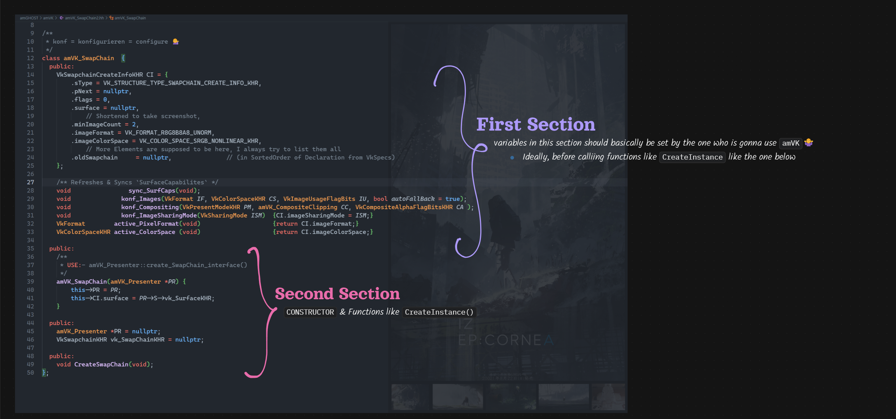
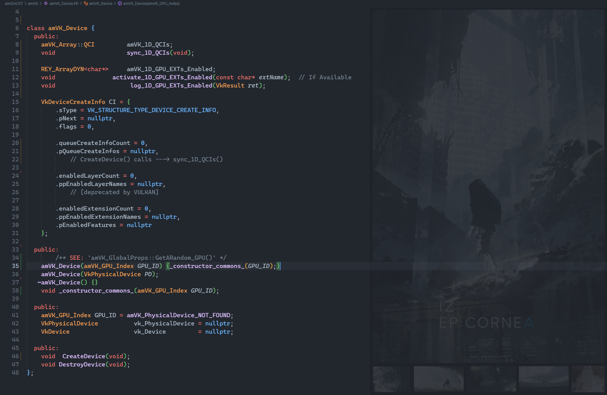

## Read the [`./guide/4.guide.md`](https://github.com/REYNEP/amGHOST/blob/main/amVK/guide/4.guide.md)

## `amVK_Class`

2560x1200px
made with affine.pro


## `Flow / Directions / Guide`
1. `amVK_Instance.hh`
2. `amVK_GPU.hh`
3. `amVK_InstanceProps.hh`
4. `amVK_Device.hh`
5. `amVK_DeviceQCI.hh`
6. `amVK_Surface.hh`
7. `amVK_SurfacePresenter.hh`
8. `amVK_SwapChain.hh`
9. `amVK_ColorSpace.hh`
10. `amVK_RenderPass.hh`
11. `amVK_RenderPass_Descriptors.hh`
12. `REY_Utils.hh` ---> `REY_Array` & `REY_ArrayDYN`
13. `amVK_Image.hh`
14. `amVK_FrameBuffer.hh`

## amVK vs amGHOST
- This is a little bit different than `amGHOST`. 
    - `amGHOST`:- Window & Such objects are instanced from `amG_HEART->new_window_interface()` and such and such. 
    - `amVK`:- but in, `amVK`, you rather gotta do `amVK_Device *D = new amVK_Device();` 
        - -> i.e. you can just create the object yourself.
1. `naming convention`:- different
2. `amGHOST_System` === `amVK_Instance`
3. `amGHOST`:- object types are `pure virtual`
    - which means that you cannot _**'instantiate'**_ these `pure virtual` classes directly.... 
        - but rather take instance of `derived classes` that implements those `pure virtual functions`. 
        - this idea is also called `interface`
    - `amVK` doesn't have that problem, 
        - cz there's nothing to me made _**"platform independent"**_

## Example
```cpp
#include "amGHOST_System.hh"

#include "amVK_InstanceProps.hh"
#include "amVK_Instance.hh"
#include "amVK_Device.hh"

#include "amGHOST_VkSurfaceKHR.hh"
#include "amVK_Surface.hh"

#include "amVK_SurfacePresenter.hh"

#include "amVK_SwapChain.hh"
#include "amVK_ColorSpace.hh"
#include "amVK_RenderPass.hh"
#include "amVK_RenderPass_Descriptors.hh"
#include "amVK_CommandBuffer.hh"

int main(int argumentCount, char* argumentVector[]) {
    REY::cout << "\n";

    amGHOST_System::create_system();

    amGHOST_Window *W = amGHOST_System::heart->new_window_interface();
    W->create(L"Whatever", 0, 0, 500, 600);


    REY_LOG("");
    REY_LOG("");
    // TwT
    {
            REY_LOG("");
        amVK_InstanceProps::EnumerateInstanceExtensions();
        amVK_Instance::addTo_1D_InstanceEXTs_Enabled("VK_KHR_surface");
        amVK_Instance::addTo_1D_InstanceEXTs_Enabled(amGHOST_System::get_vulkan_os_surface_ext_name());
        amVK_Instance::CreateInstance();    // initializes amVK_HEART


            REY_LOG("");
        VkSurfaceKHR  VK_S = amGHOST_VkSurfaceKHR::create_surface(W, amVK_Instance::vk_Instance);


            REY_LOG("");
        amVK_InstanceProps::EnumeratePhysicalDevices();
        amVK_InstanceProps::GetPhysicalDeviceQueueFamilyProperties();
        amVK_InstanceProps::EnumerateDeviceExtensionProperties();

        amVK_Device* D = new amVK_Device(amVK_InstanceProps::GetARandom_GPU());
            D->Default_QCI__select_QFAM_Graphics();
            D->addTo_1D_GPU_EXTs_Enabled("VK_KHR_swapchain");
            D->CreateDevice();

        
            REY_LOG("")
        amVK_Surface   *S  = new amVK_Surface(VK_S);
        amVK_SurfacePresenter  *PR = new amVK_SurfacePresenter();
                                PR->bind_Surface(S);
                                PR->bind_Device(D);
                                PR->create_SwapChain_interface();       // This amVK_SwapChain is Bound to this amVK_Surface
            
            REY_LOG("")
        amVK_SwapChain *SC =    PR->SC;
            SC->konf_ImageSharingMode(VK_SHARING_MODE_EXCLUSIVE);
            SC->konf_Images(
                amVK_IF::RGBA_8bpc_UNORM,   // VK_FORMAT_R8G8B8A8_UNORM
                amVK_CS::sRGB,              // VK_COLOR_SPACE_SRGB_NONLINEAR_KHR
                amVK_IU::Color_Display      // VK_IMAGE_USAGE_COLOR_ATTACHMENT_BIT
            );
            SC->konf_Compositing(
                amVK_PM::FIFO,              // VK_PRESENT_MODE_FIFO_KHR
                amVK_CC::YES,               // Clipping:- VK_TRUE
                amVK_TA::Opaque             // VK_COMPOSITE_ALPHA_OPAQUE_BIT_KHR
            );
            PR->sync_SC_SurfCaps();         // refresh/fetch & set/sync ---> latest SurfCaps

            SC->CI.oldSwapchain     = nullptr;
            PR->CreateSwapChain();

        amVK_SwapChainIMGs *SC_IMGs = PR->create_SwapChainImages_interface();
            SC_IMGs->GetSwapChainImagesKHR();
            SC_IMGs->CreateSwapChainImageViews();

        amVK_RenderPass *RP = PR->create_RenderPass_interface();
            amVK_RPADes::ColorPresentation.format = SC->CI.imageFormat;

            RP->AttachmentInfos.push_back(amVK_RPADes::ColorPresentation);
            RP->SubpassInfos   .push_back(amVK_RPSDes::ColorPresentation);
            RP->Dependencies   .push_back(amVK_RPSDep::ColorPresentation);

            RP->sync_Attachments_Subpasses_Dependencies();
            PR->CreateRenderPass();
        
        amVK_RenderPassFBs *FBs = PR->create_FrameBuffers_interface();
            FBs->CreateFrameBuffers();
        amVK_CommandPool *CP = PR->create_CommandPool_interface();
            PR->CreateCommandPool();
            CP->AllocateCommandBuffers();
            
            PR->BeginCommandBuffer();
            PR->RPBI_ReadyUp();
            PR->BeginRenderPass();

        amVK_InstanceProps::Export_nilohmannJSON();
    }
    REY_LOG("");
    REY_LOG("");


    REY::cin.get();     // wait for terminal input
    W->destroy();

    REY::cout << "\n";
}
```

## Naming Conventions
1. Simple Wrappers around `vulkan` functions
    ```cpp
    bool called_GetPhysicalDeviceSurfaceFormatsKHR = false;
    bool called_GetPhysicalDeviceSurfaceCapabilitiesKHR = false;
    void        GetPhysicalDeviceSurfaceInfo(void);
    void        GetPhysicalDeviceSurfaceCapabilitiesKHR(void);

    amVK_SwapChain {
            // Notice the "Capital-C" @ 'Chain', i didn't do this at any other functions
        void CreateSwapChain(void) {
            VkResult return_code = vkCreateSwapchainKHR(this->D->m_device, &CI, nullptr, &this->SC);
            amVK_return_code_log( "vkCreateSwapchainKHR()" );     // above variable "return_code" can't be named smth else
        }
    }
    ```
2. amVK Object/Instances Creation
    ```cpp
    amVK_SwapChain* amVK_SurfacePresenter::create_SwapChain(void);
    ```
3. 


## Vulkan Structure
```cpp
VkInstance 
    VkPhysicalDevices
        VkDevice
            VkComandPool
                VkCommandBuffer
            VkSemaPhore
            VkFench

    VkSurfaceKHR
        VkPhysicalDevice
            Capabilities
        VkSwapchainKHR(VkDevice)
            VkImage
                VkImageView
        VkRenderPass(VkDevice)
            VkAttachments
            VkSubPasses
            VkFrameBuffers
    
    RenderLoop
        Record(VkCommandBuffer)
```

## Verbs to Remember
1. query_SurfCap 🕵️♂️
2. update_SurfCap 🔄
3. load_SurfCap 📥
4. acquire_SurfCap 🔗
5. get_SurfCap 📤
6. grab_SurfCap	👐
7. snag_SurfCap	🎣 (Quick pull)
8. pluck_SurfCap	✂️ (Precision)
9. selected_gpu_surfCap	🎯 (Targeted)	Emphasizes the GPU_Index selection.
10. current_surfCap	⏳ (Stateful)
11. yoink_SurfCap	🦄 (Playful)	VkSurfaceCapabilitiesKHR* cap = yoink_SurfCap();
12. procure_SurfCap	🕴️ (Formal)	procure_SurfCap() → Sounds like a business transaction!
13. obtain_SurfCap	🏆 (Success)
14. collect_SurfCap	📚 (Gathering)
15. retrieve_SurfCap	🎯 (Accuracy)
16. sync_SurfCap	🔄 (Sync State)
17. pull_SurfCap	🪢 (Tug-of-war)
18. refresh_SurfCap	💫 (Update)
19. reload_SurfCap	♻️ (Reload)
20. populate_SurfCap	🌱 (Fill Data)
21. enumerate_SurfCap	📇 (Listing)
22. summon_SurfCap	🧙♂️ (Magic)
23. harvest_SurfCap	🌾 (Farm)
24. fish_SurfCap	🎣 (Fishing)
25. dial in	🎛️ (Precision)
26. shape up	🌟 (Polishing)
27. rig	🛠️ (Hacky)
28. tailor	👗 (Custom-fit)
29. access_SurfCap 🔍
30. craft	🧙♂️ (Artisan)
31. surfCap 📋 (property-style)
32. surfCap_ptr 🎯 (or surfCapRef)


 * Rule #1:- Any Function Implementation that is Intuitive (from the perspective of a beginner) 
 *              ==> Does not have to be implemented in the header
 *              ==> it should rather be inside `amVK_InstanceProps.cpp`