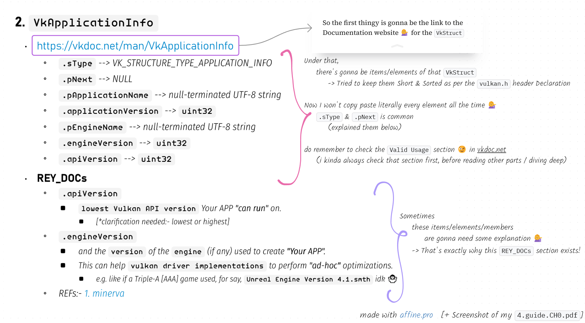

<div align=center>


</div>

## Chapter 1: `VkInstance`
#### 0. `amVK` wrap 🌯
```cpp
    #include "amVK_Instance.hh"
        // TwT
    amVK_Instance::AppInfo              // VkApplicationInfo        [public]
    amVK_Instance::CI                   // VkInstanceCreateInfo     [public]
        // You can modify these as you wish 😊
    amVK_Instance::CreateInstance();    // initializes amVK_HEART
```


<div class="REY_NOSHOW_PDF">

-------------------------------------------------------------------
<div align=center style="font-size: 50px; font-family: 'Iosevka Curly'; ">Page-Break</div>
</div>
<div class="REY_PAGEBREAK" style="page-break-after: always;"></div>
<div class="REY_NOSHOW_PDF">

-------------------------------------------------------------------
</div>


#### 1. `Notes on 'Notes'`

- https://vkdoc.net/man/VkApplicationInfo
    - `.sType`:-
        - 🟪 almost every `VkStruct` is gonna have this field/member 💁‍♀️
        - must be
            - `VK_STRUCTURE_TYPE_APPLICATION_INFO` for `VkApplicationInfo`
            - `VK_STRUCTURE_TYPE_INSTANCE_CREATE_INFO` for `VkInstanceCreateInfo`
            - `VK_STRUCTURE_TYPE_DEVICE_CREATE_INFO` for `VkDeviceCreateInfo`
            - and so on... (you get the idea)
            </br>

    - `.pNext`:-
        - 🟪 almost every `VkStruct` is gonna have this field/member 💁‍♀️
        - must be `NULL`
            - for most of the `VkStruct`s it isss kinda `NULL` 💁‍♀️
        - but it has an interesting use case:-
            - https://vkdoc.net/man/VkDeviceCreateInfo#VUID-VkDeviceCreateInfo-pNext-pNext
            - you can kinda like pass in pointer to `VkStructEXT` when you need those Extension features 💁‍♀️
            </br>

    - `.pApplicationName` --> null-terminated UTF-8 string
    - `.applicationVersion` --> `uint32`
        - you as the developer of your application can set it to arbitrarily anything you want it to 💁‍♀️, say
            - 101
            - 005
            - 1
            - 2025
    - `.pEngineName` --> null-terminated UTF-8 string
    - `.engineVersion` --> `uint32`
    - `.apiVersion` --> `uint32`
    </br>

- ###### again.... yeah, do remember to check the `Valid Usage` section 😉
</br>

- There's a alternative to vkdoc.net
    - https://github.com/ivirtex/vulkan-hover-docs/tree/master/vscode_ext/vulkan_man_md_pages/VkInstanceCreateFlagBits.md
    - it is also available as an extension in `vscode` --> `ivirtex.vulkan-hover-docs`
    </br>

     

- Symbols
    - 🟪:- kinda means nothing
        - i kinda used to like make it look like a bit pattern-ish iguess 🥴🫢
    - 🟨:- "Yellow Card"
        - it means, you don't need to hesitate about this thingy right now 💁‍♀️ we will focus on this element later 🤭
    - 🟧:- "Orange Card"
        - it means, this element is probably never gonna be 'necessary' for vulkan applications 💁‍♀️
        </br> 
    - [The extended list can be found in 🔗 **_Chapter3.14_**]


<div class="REY_NOSHOW_PDF">

-------------------------------------------------------------------
<div align=center style="font-size: 50px; font-family: 'Iosevka Curly'; ">Page-Break</div>
</div>
<div class="REY_PAGEBREAK" style="page-break-after: always;"></div>
<div class="REY_NOSHOW_PDF">

-------------------------------------------------------------------
</div>


#### 2. `VkApplicationInfo`
- https://vkdoc.net/man/VkApplicationInfo
    - `.sType` = 🟪 `VK_STRUCTURE_TYPE_APPLICATION_INFO`
    - `.pNext` = 🟪 `NULL`
    - `.pApplicationName` --> null-terminated UTF-8 string
    - `.applicationVersion` --> `uint32`
    - `.pEngineName` --> null-terminated UTF-8 string
    - `.engineVersion` --> `uint32`
    - `.apiVersion` --> `uint32`

- ##### 📜 REY_DOCs
    - `.apiVersion`
        - `lowest Vulkan API version` Your APP **_"can run"_** on. 
            - [*clarification needed:- lowest or highest]
    - `.engineVersion`
        - and the `version` of the `engine` (if any) used to create **_"Your APP"._**
        - This can help `vulkan driver implementations` to perform **_"ad-hoc"_** optimizations.
            - e.g. like if a Triple-A [AAA] game used, for say, `Unreal Engine Version 4.1.smth` idk 🤷‍♀️
    - REFs:- [1. minerva](https://paminerva.github.io/docs/LearnVulkan/01.A-Hello-Window)
    </br>

- yes, what are you waiting for 🤷‍♀️  go go, shooo.... (🤭)
    1. `#include <vulkan/vulkan.h>`
    2. take an instance of that `Struct` -> Fill it up [😉][have the vkdoc.net as assist]
    </br>


#### 3. `VkInstanceCreateInfo`
- https://vkdoc.net/man/VkInstanceCreateInfo
    - `.sType` = 🟪 `VK_STRUCTURE_TYPE_INSTANCE_CREATE_INFO`
    - `.pNext` = 🟪 `NULL`
        - or some interesting Extensions 😉 (will talk about them later)
    - `.flags` --> 🟧 `VkInstanceCreateFlagBits`
        - https://vkdoc.net/man/VkInstanceCreateFlagBits | [ivirtex-github](https://github.com/ivirtex/vulkan-hover-docs/tree/master/vscode_ext/vulkan_man_md_pages/VkInstanceCreateFlagBits.md)
    - `.pApplicationInfo` --> 🟪 💁‍♀️ Duh!
    - `.ppEnabledLayerNames` --> 🟨 **ChapterZZZ**
    - `.ppEnabledExtensionNames` --> 🟨 **_Chapter4.2_**
        - Don't hesitate about `EnabledLayer` & `EnabledExtensions` right now
            - come back and add them when you need to 😊
            - This is what I would mean, when i would point smth to a later chapter
            - I will add the 🟨 ("Yellow Card") too!
- ##### 📜 REY_DOCs
    - Nothing that I need to add, in this section
    - Tho if this section gets big, I will create a separate `.md` file for that thingy


<div class="REY_NOSHOW_PDF">

-------------------------------------------------------------------
<div align=center style="font-size: 50px; font-family: 'Iosevka Curly'; ">Page-Break</div>
</div>
<div class="REY_PAGEBREAK" style="page-break-after: always;"></div>
<div class="REY_NOSHOW_PDF">

-------------------------------------------------------------------
</div>


#### 4. A 😎 Cool `vscode` / `visual-studio` extension if you want 💁‍♀️
- https://github.com/ivirtex/vulkan-hover-docs
- `vscode` --> `ivirtex.vulkan-hover-docs`


-------------------------------------------------------------------


#### 5. `VkInstance m_instance = nullptr;`
- https://vkdoc.net/man/VkInstance

#### 6. `vkCreateInstance(CI, nullptr, &m_instance)`
- https://vkdoc.net/man/vkCreateInstance
    - `param pCreateInfo` = 🟪 💁‍♀️ Duh!
    - `param pAllocator` = 🟪 `nullptr`
    - `param pInstance` = 🟪 `&m_instance`
 
- ##### 📜 REY_DOCs
    - `param pAllocator` = 🟪 `nullptr`
        - `VkAllocationCallbacks` 🟨 **ChapterZZZ**
            - I will make a chapter on this 🤭 [https://vkdoc.net/chapters/memory#memory-allocation]
        - Vulkan provides applications the opportunity to perform host memory allocations
        - If this feature is not used
            - the implementation will perform its own memory allocations.
        - Since most memory allocations are off the critical path, this is not meant as a performance feature. Rather, this can be useful for certain embedded systems, for debugging purposes (e.g. putting a guard page after all host allocations), or for memory allocation logging.


-------------------------------------------------------------------


#### 7. 🚨 Error Handling / Checking / 🪵 Logging
- check out my [`amVK_log.hh`](./../../amVK/utils/amVK_log.hh)
    - uses [REY_LoggerNUtils](https://github.com/REYNEP/amGHOST) inside amGHOST
        - has a simple `stackTracer()` that i basically stripped from blender3D codebase 🥴

#### 8. `📽️ So far, The result`
- [4.guide.chapter1.hh](./examples/4.guide.chapter1.hh)


-------------------------------------------------------------------


#### 9. The Unused ones
1. `vkEnumerateInstanceExtensionProperties()` --> 🟨 **_Chapter4.2_**
    -  https://vkdoc.net/man/vkEnumerateInstanceExtensionProperties
2. `Add_InstanceEXT_ToEnable(const char* extName)` --> 🟨 **_Chapter4.2_**
    - this is a **_amVK/REY_** Custom Function