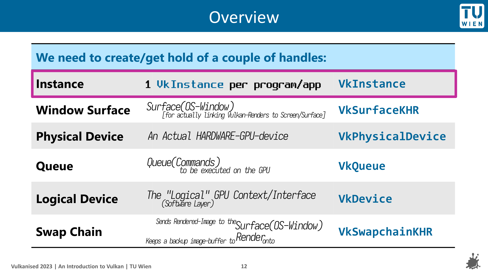

<div align=center>

## Chapter 2: `VkDevice`


Take a look into this awesome [slide](./Vulkanised-2023-Tutorial/Vulkanised-2023-Tutorial-PART1.pdf) from slide-26 onwards, to understand what each of steps _"feel like"/mean/"how to imagine them"_.
*slide = [Vulkanised 2023 Tutorial Part 1](https://www.khronos.org/assets/uploads/developers/presentations/Vulkanised-2023-Tutorial-PART1.pdf)

</div>
</br>
</br>

#### 0. `amVK` wrap 🌯
```cpp
    #include "amVK_InstancePropsEXT.hh"
    #include "amVK_Device.hh"

        // TwT
        REY_LOG("");
    amVK_InstancePropsEXT::EnumeratePhysicalDevices();
    amVK_GPUProps  *GPUProps = amVK_InstancePropsEXT::GetARandom_GPU();
                    GPUProps->GetPhysicalDeviceQueueFamilyProperties();

    amVK_Device* D = new amVK_Device(GPUProps->vk_PhysicalDevice);
        D->Default_QCI__select_QFAM_Graphics();
        D->CI                           // VkDeviceCreateInfo       [public]
        D->QCI.ptr_Default              // VkDeviceQueueCreateInfo  [public]
        D->QCI.TheArray                 // REY_ArrayDYN<VkQCI>      [public]
            // You can take your own VkDeviceQueueCreateInfo & push_back into this array 💁‍♀️
        D->CreateDevice();
```


<div class="REY_NOSHOW_PDF">

-------------------------------------------------------------------
<div align=center style="font-size: 50px; font-family: 'Iosevka Curly'; ">Page-Break</div>
</div>
<div class="REY_PAGEBREAK" style="page-break-after: always;"></div>
<div class="REY_NOSHOW_PDF">

-------------------------------------------------------------------
</div>


#### 1. `vkEnumeratePhysicalDevices(m_instance, &m_deviceCount, nullptr)`
- https://vkdoc.net/man/vkEnumeratePhysicalDevices
- ##### `</> TheCode`
    ```cpp
    uint32_t deviceCount = 0;     
        // [implicit valid usage]:- must be 0 [if 3rd-param = nullptr]
        vkEnumeratePhysicalDevices(m_instance, &deviceCount, nullptr);
            // it's kinda like the function is 'output-ing into' deviceCount

    std::vector<VkPhysicalDevice> HardwareGPU_List(gpuCount);
        // best to save this as a class member variable
        vkEnumeratePhysicalDevices(m_instance, &deviceCount, HardwareGPU_List.data());
            // note: it does return     VkResult return_code
    ```
    - `👀 Visualization / [See it] / JSON Printing`:- [4.guide.chapter2.1.json.hh](./examples/4.guide.chapter2.1.json.hh)
    - `📽️ So far, The result`:- [4.guide.chapter2.1.midway.hh](./examples/4.guide.chapter2.1.midway.hh)

-------------------------------------------------------------------

#### 2. `vkCreateDevice()`
- https://vkdoc.net/man/vkCreateDevice
    - `param physicalDevice` 🟪 `HardwareGPU_List[0]`
        - How to _'choose'_? 🟨 **_Chapter2.11_**
    - `param pCreateInfo` 🟪💁‍♀️
    - `param pAllocator` 🟨 **ChapterZZZ**
    - `param pDevice` 🟪 `&m_Device`

> 

- ##### `📽️ So far, The result`:- 
    - [4.guide.chapter2.2.midway.hh](./examples/4.guide.chapter2.2.midway.hh)
    <div style="page-break-after: always;"></div>

-------------------------------------------------------------------

#### 3. `VkDeviceCreateInfo`
- https://vkdoc.net/man/VkDeviceCreateInfo
    - `.sType` 🟪 `VK_STRUCTURE_TYPE_DEVICE_CREATE_INFO`
    - `.pNext` 🪐 `nullptr`
        - 🪐 almost any EXT that you are gonna enable.... is prolly gonna end up being passed on here.... tied to `VkDeviceCI` 💁‍♀️
    - `.flags` 🏴 `0`
        - 🏴: "No Flag" 
        - `VkSpecs` Says:- `reserved for future use`
        </br>

    - `.pQueueCreateInfos` 🔗 _Next SubChapter_
        - Multiple Queue Create Infos:- 🟨 **_Chapter2.8_**
    - `.ppEnabledLayerNames` ⚠️ _deprecated [by Vulkan]_
    - `.ppEnabledExtensionNames` 🟨 **_Chapter4.2_**
    - `.pEnabledFeatures` 🟨 **ChapterZZZ**
        - This should be really interesting

- ##### 📜 REY_DOCs
    - `.pQueueCreateInfos` -> yes, you 'can' pass multiple 😉
    - Sometimes there will be `.zzzCreateInfoCount` & `.pZZZCreateInfos` 
        - So you could like pass in an array/vector
        - You will see this in lots of other places

- ##### `📽️ So far, The result`:- 
    - [4.guide.chapter2.3.midway.hh](./examples/4.guide.chapter2.3.midway.hh)

-------------------------------------------------------------------

#### 4. `VkDeviceQueueCreateInfo` - *'The Real Deal'*
- https://vkdoc.net/man/VkDeviceQueueCreateInfo
    - `.sType` 🟪 `VK_STRUCTURE_TYPE_DEVICE_QUEUE_CREATE_INFO`
    - `.pNext` 🪐 `nullptr`
        - 🪐 2 Extensions 😉 (will talk about them later)
    - `.flags` 🏳️ `0`
        - 🪐 https://vkdoc.net/man/VkDeviceQueueCreateFlagBits | [ivirtex-github](https://github.com/ivirtex/vulkan-hover-docs/tree/master/vscode_ext/vulkan_man_md_pages/VkDeviceQueueCreateFlagBits.md)
        - 🚩: "Only Option" 
            - `VK_DEVICE_QUEUE_CREATE_PROTECTED_BIT` [Protected Queue]
        </br>
        
    - `.queueFamilyIndex` 🔗 _Next 3 SubChapters_
        - `vkGetPhysicalDeviceQueueFamilyProperties()` --> look for a QueueFamily that supports `VK_QUEUE_GRAPHICS_BIT`
    - `.queueCount`
    - `.pQueuePriorities` --> yes, this can be multiple "Priorities" 🥴 [idk yet why tho]
        - Range = (0.0 -> 1.0) [inclusive]
        - Within the same device, queues with higher priority may be allotted more processing time than queues with lower priority.
    </br>

- ##### `📽️ So far, The result`:-
    - We are gonna take a Big Leap & Start connecting to 🔗 `GITHUB`
    - [amVK_DeviceQCI.hh](https://github.com/REYNEP/amGHOST/blob/1f6bfe014c42962f935a546c39ddb237ff99d002/amVK/core/amVK_DeviceQCI.hh#L9-L15)


<div class="REY_NOSHOW_PDF">

-------------------------------------------------------------------
<div align=center style="font-size: 50px; font-family: 'Iosevka Curly'; ">Page-Break</div>
</div>
<div class="REY_PAGEBREAK" style="page-break-after: always;"></div>
<div class="REY_NOSHOW_PDF">

-------------------------------------------------------------------
</div>


#### 5. `vkGetPhysicalDeviceQueueFamilyProperties()`
- https://vkdoc.net/man/vkGetPhysicalDeviceQueueFamilyProperties
- ##### 📜 REY_DOCs
    - a GPU can have _"multiple QueueFamilies"_
        - a `QueueFamily` might support `VK_QUEUE_GRAPHICS_BIT`
        - another `QueueFamily` might support `VK_QUEUE_COMPUTE_BIT`
        - another `QueueFamily` might support `VK_QUEUE_TRANSFER_BIT`
        - another `QueueFamily` might support `VK_QUEUE_VIDEO_ENCODE_BIT_KHR`
        - another `QueueFamily` might support a-mixture of multiple
        - talking about this in -> 🔗 _Next SubChapter_
        </br>

- ##### `</> TheCode` [OldWay]
    ```cpp
    #define GPUs                                amVK_InstanceProps::s_HardwareGPU_List
    #define amVK_2D_GPUs_QFAMs                     amVK_Instance::s_HardwareGPU_QFamProps_List2D
    static inline REY_Array<REY_Array<VkQueueFamilyProperties>>   s_HardwareGPU_QFamProps_List2D;
        // REY_Array --> "REY_LoggerNUtils/REY_Utils.hh" 😄
        // 1 System/PC
            // multiple GPU
                // multiple QFamProps
    ```
    ```cpp
    static inline void GetPhysicalDeviceQueueFamilyProperties(void) {
        amVK_2D_GPUs_QFAMs.reserve(GPUs.n);            // malloc using "new" keyword
        for ( uint32_t k = 0;  k < GPUs.n; k++ )       // for each GPU
        {
            REY_Array<VkQueueFamilyProperties> *k_QFamProps = &amVK_2D_GPUs_QFAMs.data[k];

            uint32_t QFamCount = 0;
                vkGetPhysicalDeviceQueueFamilyProperties(GPUs[k], &QFamCount, nullptr);

            k_QFamProps->n = QFamCount;
            k_QFamProps->data = new VkQueueFamilyProperties[QFamCount];
                vkGetPhysicalDeviceQueueFamilyProperties(GPUs[k], &k_QFamProps->n, k_QFamProps->data);
        }
        #undef GPUs
    }
    ```
    - `👀 Visualization / [See it] / JSON Printing`:- [4.guide.chapter2.5.json.hh](./examples/4.guide.chapter2.5.json.hh)
        - Check the [3070 JSON by REY](./examples/4.guide.chapter2.5.data.json)
    - `📽️ So far, The result`:- **_OldWay_** [4.guide.chapter2.5.amVK_Instance.hh](./examples/4.guide.chapter2.5.amVK_Instance.hh)
        - Compare to -> [4.guide.chapter2.1.midway.hh](./examples/4.guide.chapter2.1.midway.hh)
            - `2DArray_QFAM_Props` part & below were added only compared to `Chapter2.1.`
            </br> 
    - `📽️ So far, The result`:- 🔗 `GITHUB`
        - [amVK_GPUProps.hh](https://github.com/REYNEP/amGHOST/blob/1f6bfe014c42962f935a546c39ddb237ff99d002/amVK/utils/amVK_GPUProps.hh)
        - [amVK_GPUProps.cpp#L5-L17](https://github.com/REYNEP/amGHOST/blob/1f6bfe014c42962f935a546c39ddb237ff99d002/amVK/utils/amVK_GPUProps.cpp#L5-L17)


<div class="REY_NOSHOW_PDF">

-------------------------------------------------------------------
<div align=center style="font-size: 50px; font-family: 'Iosevka Curly'; ">Page-Break</div>
</div>
<div class="REY_PAGEBREAK" style="page-break-after: always;"></div>
<div class="REY_NOSHOW_PDF">

-------------------------------------------------------------------
</div>


#### 6. `VkQueueFamilyProperties`
- https://vkdoc.net/man/VkQueueFamilyProperties
- ##### 📜 REY_DOCs
    - `.queueFlags` 
        - we are gonna choose a `QCI.queueFamilyIndex` based on these flags
        - primarily, for the least, we wanna choose a `QueueFamily` that supports `VK_QUEUE_GRAPHICS_BIT`
        - all kinds of amazing things can be done using 
            - `VK_QUEUE_COMPUTE_BIT`
            - `VK_QUEUE_TRANSFER_BIT`
            - `VK_QUEUE_VIDEO_ENCODE_BIT_KHR`
    - `.queueCount` 
        - yes there is a limit to 'how many `Queues` we are allowed to work with' 🥴
    - `.timestampValidBits`
    - `.minImageTransferGranularity`

-------------------------------------------------------------------

#### 7. `VkDeviceQCI.queueFamilyIndex`
- `🎯 Task` 
    - is to choose a `QueueFamily` that supports `VK_QUEUE_GRAPHICS_BIT` 😉
    - (if you've followed on so far -> this should be easy 😉) 
- ##### `</> amVK_Device.hh`
    ```cpp
    void amVK_Device::Select_QFAM_GRAPHICS(void) {
        if (!amVK_Instance::called_GetPhysicalDeviceQueueFamilyProperties) {
            amVK_Instance::EnumeratePhysicalDevices();
        }

        if (!amVK_Instance::called_GetPhysicalDeviceQueueFamilyProperties) {
            amVK_Instance::GetPhysicalDeviceQueueFamilyProperties();
        }

        amVK_Instance::amVK_PhysicalDevice_Index index = amVK_HEART->GetARandom_PhysicalDevice_amVK_Index();
        this->QCI.Default.queueFamilyIndex = amVK_Instance::ChooseAQueueFamily(VK_QUEUE_GRAPHICS_BIT, index); 
            // If you wanna see the implementation for this function
    }
    ```
    - `📽️ So far, The result`:- _**OldWay**_ (Don't spend time inside this, more than 1 minute)
        - [4.guide.chapter2.9.Props.hh](./examples/4.guide.chapter2.9.Props.hh)
        - [4.guide.chapter2.9.amVK.cpp](./examples/4.guide.chapter2.9.amVK.cpp)
        </br> 
    - `📽️ So far, The result`:- 🔗 `GITHUB` (NewWay is like 10x more organized and easier to understand)
        - [amVK_GPUProps.hh](https://github.com/REYNEP/amGHOST/blob/1f6bfe014c42962f935a546c39ddb237ff99d002/amVK/utils/amVK_GPUProps.hh)
        - [amVK_GPUProps.cpp#L266-L286](https://github.com/REYNEP/amGHOST/blob/1f6bfe014c42962f935a546c39ddb237ff99d002/amVK/utils/amVK_GPUProps.cpp#L266-L286)

-------------------------------------------------------------------

#### 8. back to `vkCreateDevice()` [finally calling it 😊]
- ##### `</> main.cpp`
    ```cpp
    amVK_Device* D = new amVK_Device(amVK_HEART->GetARandom_PhysicalDevice());
        // VkDeviceCreateInfo CI => Class Member
        // VkDeviceQueueCreateInfo QCI => Class Member
    D->Select_QFAM_GRAPHICS();
    D->CreateDevice();
    ```
    - Think of this as a PSeudoCode / or / check out my code if you wanna
    - `CreateInfo` => By default has initial values inside `amVK_Device`


<div class="REY_NOSHOW_PDF">

-------------------------------------------------------------------
<div align=center style="font-size: 50px; font-family: 'Iosevka Curly'; ">Page-Break</div>
</div>
<div class="REY_PAGEBREAK" style="page-break-after: always;"></div>
<div class="REY_NOSHOW_PDF">

-------------------------------------------------------------------
</div>


#### 9. `</> [multiple] VkDeviceCreateInfo.pQueueCreateInfos`
```cpp
/* ============ REY_LoggerNUtils::REY_Utils.hh ============ */
REY_ArrayDYN<VkDeviceQueueCreateInfo> Array = REY_ArrayDYN<VkDeviceQueueCreateInfo>(2);
    // allocate enough space for 2 elements
REY_ARRAY_PUSH_BACK(Array) = this->Default_QCI;
REY_ARRAY_PUSH_BACK(Array) =          Your_QCI;

/* ============ std::vector ============ */
std::vector<VkDeviceQueueCreateInfo> Array = std::vector<VkDeviceQueueCreateInfo>(2);
Array.push_back(this->Default_QCI);
Array.push_back(         Your_QCI)
```
- Guide on amVK_Array 🟨 **_Chapter6.6_**
- `📽️ So far, The result`:- [amVK_DeviceQCI.hh](https://github.com/REYNEP/amGHOST/blob/1f6bfe014c42962f935a546c39ddb237ff99d002/amVK/core/amVK_DeviceQCI.hh#L19)

-------------------------------------------------------------------

#### 10. Organizing stuff into classes....
- `amVK_InstanceProps.hh`
    1. `class amVK_InstanceProps`
        - `amVK_Instance::GetPhysicalDeviceQueueFamilyProperties()`
        - `amVK_Instance::EnumeratePhysicalDevices()`
        - & Everything related to those two + The Data + The Properties
    - https://github.com/REYNEP/amGHOST/tree/3e44b982902a3f3fa4ac584aefb19da3d4cdfcc6
    </br> 
    - `📽️ So far, The result`:- _**OldWay**_ (Don't spend time inside this, more than 1 minute)
        - [4.guide.chapter2.9.Props.hh](./examples/4.guide.chapter2.9.Props.hh)
        - [4.guide.chapter2.9.amVK.cpp](./examples/4.guide.chapter2.9.amVK.cpp)
        </br> 
    - `📽️ So far, The result`:- 🔗 `GITHUB` (NewWay is like 10x more organized and easier to understand)
        - [amVK_GPUProps.hh](https://github.com/REYNEP/amGHOST/blob/1f6bfe014c42962f935a546c39ddb237ff99d002/amVK/utils/amVK_GPUProps.hh)
        - [amVK_GPUProps.cpp#L266-L286](https://github.com/REYNEP/amGHOST/blob/1f6bfe014c42962f935a546c39ddb237ff99d002/amVK/utils/amVK_GPUProps.cpp#L266-L286)

-------------------------------------------------------------------

#### 11. `vkGetPhysicalDeviceProperties()` 🟨 **ChapterZZZ**
- https://vkdoc.net/man/vkGetPhysicalDeviceProperties
- https://vkdoc.net/man/VkPhysicalDeviceProperties