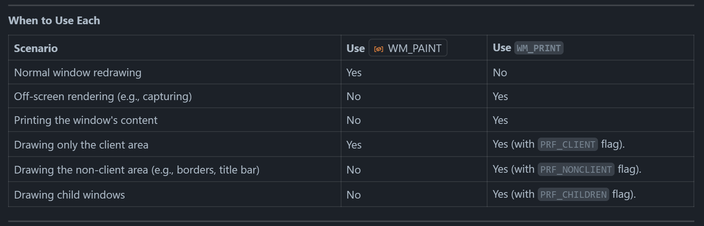
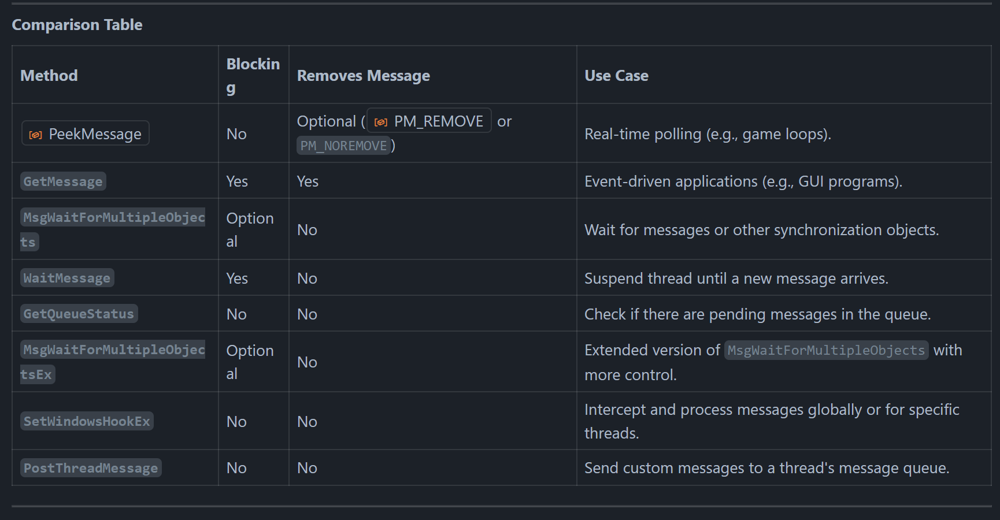
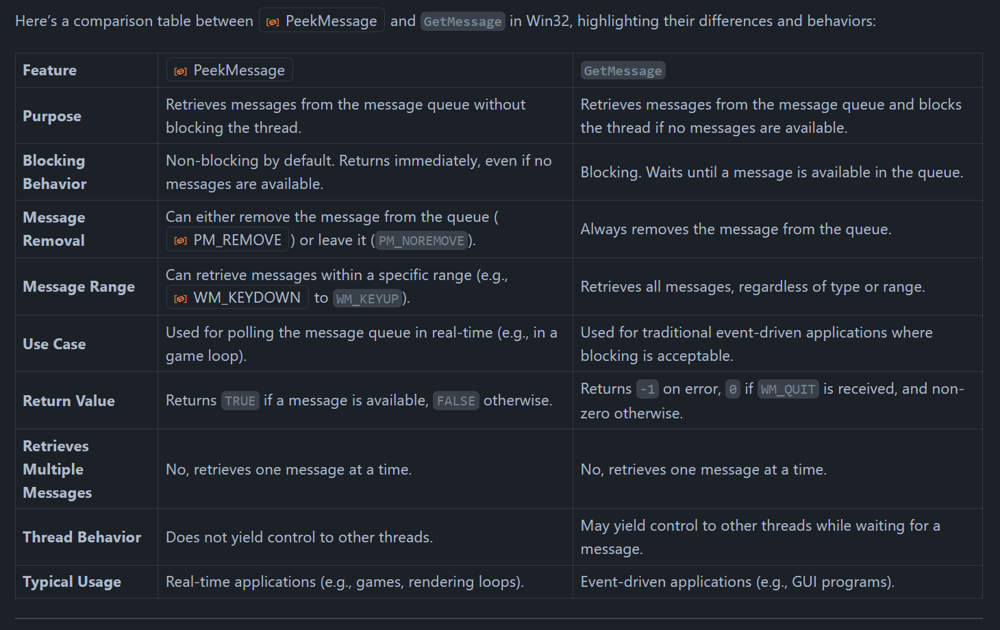
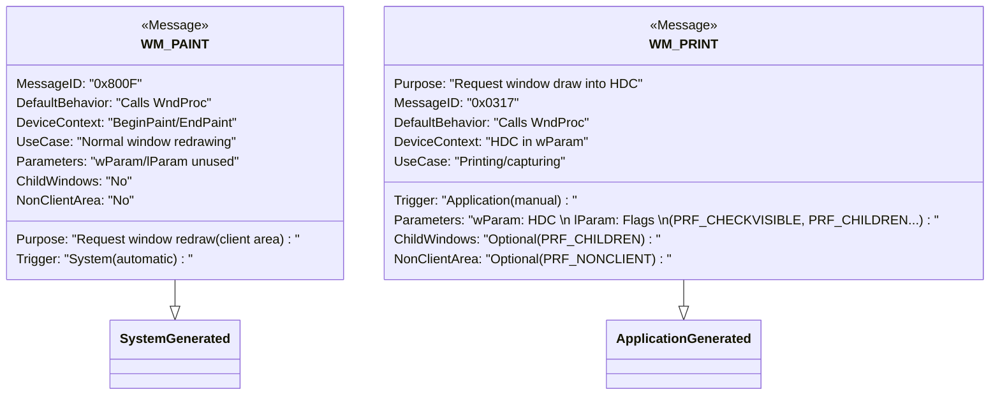

---
export_on_save:
  prince: false
---
<div class="REY_TITLEV2" align=center>

# Chapter 20: Handling OS 🖱️ InputEvents 🕹️ II


// WIP //

### 6. `amVK_SurfacePresenter`
Can't have everything scatterred now, everything is getting too much sophisticating.... 🤔 🤦‍♀️ must _**Refactor....**_

Major Decision Change

<div style="font-size: 0.75em; margin-top: -20px;">

Right now, `amVK_Surface::CTOR` creates `amVK_SurfacePresenter`. & `SwapChain, RenderPass, CommandPool` are supposed to be created from `amVK_SurfacePresenter`.

```cpp
class amVK_Surface
    amVK_SurfacePresenter {
        create_SwapChain_interface()
            new amVK_SwapChain(this)
                this->CI.surface = PR->S->vk_SurfaceKHR;
                // later amVK_SwapChain::CreateSwapChain(void) uses this->PR->D->vk_Device
        create_RenderPass_interface()
            new amVK_RenderPass(this)
                this->PR = PR;
        create_CommandPool_interface()
            new amVK_CommandPool(this)
                this->CI.queueFamilyIndex = this->PR->D->amVK_1D_QCIs.ptr_Default()->queueFamilyIndex;
        create_FrameBuffers()
            new amVK_FrameBuffer(this)
                this->CI.renderPass = this->PR->RP->vk_RenderPass;
```

Problem #1:- I think this is just a little too much deep to handle....
Problem #2:- if `amVK_SwapChain.hh` included `amVK_SurfacePresenter.hh`, then the reverse can't happen. 💁‍♀️
Thus a lot of 1-liner functions would have to be put inside `.cpp` even tho i don't want it to.

</div>
</div>

1. #### `Problem #2:- in Details`
    - [amVK_SurfacePresenter.hh#L37](https://github.com/REYNEP/amGHOST/blob/3be7cfcd154b383cd98783d302468f63fda0618b/amVK/amVK_SurfacePresenter.hh#L37)
    - [amVK_SwapChain.hh#L48](https://github.com/REYNEP/amGHOST/blob/3be7cfcd154b383cd98783d302468f63fda0618b/amVK/amVK_SwapChain.hh#L48)
    - The Solution
        - `C1`:- Don't include `amVK_SurfacePresenter.hh` in `amVK_SwapChain.hh` but rather inside `amVK_SwapChain.cpp`
        - `C2`:- Don't include `amVK_SwapChain.hh` in `amVK_SurfacePresenter.hh` but rather inside `amVK_SurfacePresenter.cpp`
    - `Case 1`:-
        - `amVK_SwapChain::CONSTRUCTOR`
        - `sync_SurfCaps()`
        - both of these have to go inside `amVK_SwapChain.cpp`
    - `Case 2`:-
        - `amVK_SurfacePresenter::sync_SC_SurfCaps()`
        - `amVK_SurfacePresenter::synced_ImageExtent()`
        - both of these (& as of my plan right now, heck ton of other 1 liner function) are gonna have to go inside `amVK_SurfacePresenter.cpp`

2. #### Weeelll
    - There is one other solution.... That is to change the design.... Which is what I figured is should do.... Not everybody would want to use `amVK_SurfacePresenter` anyway 💁‍♀️
    - 2 Ways:-
    1. Making `amVK_SurfacePresenter` Optional
        1. None of the other amVK_Class is gonna depend on this anymore
        2. amVK_SurfacePresenter serving as like a top level NODETREE system with extra PRESET Functions / soo. (If you are looking from a NodeEditor perspective)
        3. This is like having a BIG BAD NODE, and then connecting everything into it
        4. You can have anything you want in the header
        5. Let's try the other one and see what happens
    2. Making `amVK_SurfacePresenter` Code part
        1. EveryBody is gonna depend on this
        2. They are only gonna keep a pointer to this parent
        3. from this one, they are gonna get everything that they need
        4. even the VkDevice
        5. It's like having all the nodes inside a TOP LEVEL FRAME NODE
        6. Separating Code into .hh & .cpp is kinda crazy..... You basically can't have anything in the header....
        7. i already tried this

</br>
</br>
<div align=center>
<div style="font-size: 0.75em;">

Before Commit:- https://github.com/REYNEP/amGHOST/blob/9cec3e58db123144bd8d88363ccf9a4a7ffc9edc/amVK/amVK_Surface.hh
Middle (Discarded) Commit:- https://github.com/REYNEP/amGHOST/blob/3be7cfcd154b383cd98783d302468f63fda0618b/amVK/amVK_SurfacePresenter.hh
Final Commit:- https://github.com/REYNEP/amGHOST/blob/7376cdb5c2c6eee19655dae436e6cf8edd02e1d5/amVK/amVK_SurfacePresenter.hh

</div>

#### `📽️ So far, The result` [🔗 `GITHUB`]

</div>

<table width="100%" border="1">
<tr>
<td width="50%">
</br>

- 🗂️ `common`
    - 📝 [amVK.hh](https://github.com/REYNEP/amGHOST/blob/7376cdb5c2c6eee19655dae436e6cf8edd02e1d5/amVK/common/amVK.hh)
    - 📝 [amVK_ColorSpace.hh](https://github.com/REYNEP/amGHOST/blob/7376cdb5c2c6eee19655dae436e6cf8edd02e1d5/amVK/common/amVK_ColorSpace.hh)
    - 📝 [amVK_Enum2String.cpp](https://github.com/REYNEP/amGHOST/blob/7376cdb5c2c6eee19655dae436e6cf8edd02e1d5/amVK/common/amVK_Enum2String.cpp)
    - 📝 [amVK_Enum2String.hh](https://github.com/REYNEP/amGHOST/blob/7376cdb5c2c6eee19655dae436e6cf8edd02e1d5/amVK/common/amVK_Enum2String.hh)
    - 📝 [amVK_GPU.hh](https://github.com/REYNEP/amGHOST/blob/7376cdb5c2c6eee19655dae436e6cf8edd02e1d5/amVK/common/amVK_GPU.hh)
    - 📝 [amVK_RenderPass_Descriptors.hh](https://github.com/REYNEP/amGHOST/blob/7376cdb5c2c6eee19655dae436e6cf8edd02e1d5/amVK/common/amVK_RenderPass_Descriptors.hh)
    - 📝 [amVK_log.cpp](https://github.com/REYNEP/amGHOST/blob/7376cdb5c2c6eee19655dae436e6cf8edd02e1d5/amVK/common/amVK_log.cpp)
    - 📝 [amVK_log.hh](https://github.com/REYNEP/amGHOST/blob/7376cdb5c2c6eee19655dae436e6cf8edd02e1d5/amVK/common/amVK_log.hh)
- 🗂️ `core`
    - 📝 [amVK_Instance.hh](https://github.com/REYNEP/amGHOST/blob/7376cdb5c2c6eee19655dae436e6cf8edd02e1d5/amVK/core/amVK_Instance.hh)
    - 📝 [amVK_Device.hh](https://github.com/REYNEP/amGHOST/blob/7376cdb5c2c6eee19655dae436e6cf8edd02e1d5/amVK/core/amVK_Device.hh)
    - 📝 [amVK_DeviceQCI.hh](https://github.com/REYNEP/amGHOST/blob/7376cdb5c2c6eee19655dae436e6cf8edd02e1d5/amVK/core/amVK_DeviceQCI.hh)
    - 📝 [amVK_Surface.hh](https://github.com/REYNEP/amGHOST/blob/7376cdb5c2c6eee19655dae436e6cf8edd02e1d5/amVK/core/amVK_Surface.hh)
    - 📝 [amVK_SwapChain.hh](https://github.com/REYNEP/amGHOST/blob/7376cdb5c2c6eee19655dae436e6cf8edd02e1d5/amVK/core/amVK_SwapChain.hh)
    - 📝 [amVK_SwapChainIMGs.hh](https://github.com/REYNEP/amGHOST/blob/7376cdb5c2c6eee19655dae436e6cf8edd02e1d5/amVK/core/amVK_SwapChainIMGs.hh)
    - 📝 [amVK_RenderPass.hh](https://github.com/REYNEP/amGHOST/blob/7376cdb5c2c6eee19655dae436e6cf8edd02e1d5/amVK/core/amVK_RenderPass.hh)
    - 📝 [amVK_RenderPassFBs.hh](https://github.com/REYNEP/amGHOST/blob/7376cdb5c2c6eee19655dae436e6cf8edd02e1d5/amVK/core/amVK_RenderPassFBs.hh)
    - 📝 [amVK_CommandPool.hh](https://github.com/REYNEP/amGHOST/blob/7376cdb5c2c6eee19655dae436e6cf8edd02e1d5/amVK/core/amVK_CommandPool.hh)
    </br> 
- 📝 [amVK_SurfacePresenter.hh](https://github.com/REYNEP/amGHOST/blob/7376cdb5c2c6eee19655dae436e6cf8edd02e1d5/amVK/amVK_SurfacePresenter.hh)

</br>
</td>
<td width="50%">

- 🗂️ `extras`
    - 📝 [SCREENSHOT_STUDIO.hh](https://github.com/REYNEP/amGHOST/blob/7376cdb5c2c6eee19655dae436e6cf8edd02e1d5/amVK/extras/SCREENSHOT_STUDIO.hh)
    - 📝 [amVK_CommandBuffer.hh](https://github.com/REYNEP/amGHOST/blob/7376cdb5c2c6eee19655dae436e6cf8edd02e1d5/amVK/extras/amVK_CommandBuffer.hh)
    - 📝 [amVK_FrameBuffer.hh](https://github.com/REYNEP/amGHOST/blob/7376cdb5c2c6eee19655dae436e6cf8edd02e1d5/amVK/extras/amVK_FrameBuffer.hh)
    - 📝 [amVK_Image.hh](https://github.com/REYNEP/amGHOST/blob/7376cdb5c2c6eee19655dae436e6cf8edd02e1d5/amVK/extras/amVK_Image.hh)
    - 📝 [amVK_SemaPhone.hh](https://github.com/REYNEP/amGHOST/blob/7376cdb5c2c6eee19655dae436e6cf8edd02e1d5/amVK/extras/amVK_SemaPhone.hh)

- 🗂️ `guide`
    - *(Directory placeholder – add guide files here if any)*

- 🗂️ `impl`
    - 📝 [amVK_Device.cpp](https://github.com/REYNEP/amGHOST/blob/7376cdb5c2c6eee19655dae436e6cf8edd02e1d5/amVK/impl/amVK_Device.cpp)
    - 📝 [amVK_Instance.cpp](https://github.com/REYNEP/amGHOST/blob/7376cdb5c2c6eee19655dae436e6cf8edd02e1d5/amVK/impl/amVK_Instance.cpp)
    - 📝 [amVK_InstanceProps.cpp](https://github.com/REYNEP/amGHOST/blob/7376cdb5c2c6eee19655dae436e6cf8edd02e1d5/amVK/impl/amVK_InstanceProps.cpp)
    - 📝 [amVK_InstancePropsExport.cpp](https://github.com/REYNEP/amGHOST/blob/7376cdb5c2c6eee19655dae436e6cf8edd02e1d5/amVK/impl/amVK_InstancePropsExport.cpp)
    - 📝 [amVK_InstancePropsExport_nloh...](https://github.com/REYNEP/amGHOST/blob/7376cdb5c2c6eee19655dae436e6cf8edd02e1d5/amVK/impl/amVK_InstancePropsExport_nloh...)
    - 📝 [amVK_Surface.cpp](https://github.com/REYNEP/amGHOST/blob/7376cdb5c2c6eee19655dae436e6cf8edd02e1d5/amVK/impl/amVK_Surface.cpp)
    - 📝 [amVK_SurfacePresenter.cpp](https://github.com/REYNEP/amGHOST/blob/7376cdb5c2c6eee19655dae436e6cf8edd02e1d5/amVK/impl/amVK_SurfacePresenter.cpp)
    - 📝 [amVK_SwapChain.cpp](https://github.com/REYNEP/amGHOST/blob/7376cdb5c2c6eee19655dae436e6cf8edd02e1d5/amVK/impl/amVK_SwapChain.cpp)

</td>
</tr>
</table>


<div class="REY_NOSHOW_PDF">

-------------------------------------------------------------------
<div align=center style="font-size: 50px; font-family: 'Iosevka Curly'; ">Page-Break</div>
</div>
<div class="REY_PAGEBREAK"></div>
<div class="REY_NOSHOW_PDF">

-------------------------------------------------------------------
</div>


### 10. `Windows WndProc`


| Feature          | WM_PAINT                                                                                                 | WM_PRINT                                                                                                                                                                                                                                                                  |
|------------------|----------------------------------------------------------------------------------------------------------|---------------------------------------------------------------------------------------------------------------------------------------------------------------------------------------------------------------------------------------------------------------------------|
| Purpose          | Sent by the system to request that a window redraw its client area.                                      | Sent by an application to request that a window draw itself into a specified device context (e.g., for printing or capturing).                                                                                                                                            |
| Trigger          | Automatically triggered by the system when the client area becomes invalid (e.g., resizing, minimizing). | Explicitly sent by an application using SendMessage to request the window to draw itself.                                                                                                                                                                                 |
| Message ID       | 0x800F                                                                                                   | 0x0317                                                                                                                                                                                                                                                                    |
| Who Sends It     | Sent by the system.                                                                                      | Sent by the application (e.g., using SendMessage(hwnd, WM_PRINT, ...)).                                                                                                                                                                                                   |
| Default Behavior | Calls the window's WndProc to handle the redraw.                                                         | Calls the window's WndProc to handle the drawing into the specified device context.                                                                                                                                                                                       |
| Device Context   | Uses the device context provided by BeginPaint and EndPaint.                                             | Uses the device context passed in wParam.                                                                                                                                                                                                                                 |
| Use Case         | Used for normal window redrawing (e.g., after invalidation or resizing).                                 | Used for off-screen rendering, printing, or capturing the window's content.                                                                                                                                                                                               |
| System-Generated | Yes, automatically generated when the client area is invalid.                                            | No, must be explicitly sent by the application.                                                                                                                                                                                                                           |
| Parameters       | - `wParam`: Not used. </br> - `lParam`: Not used.                                                        | - `wParam`: Handle to the device context (HDC). </br> - `lParam`: Flags specifying what to draw.                                                                                                                                                                          |
| Flags in lParam  | Not applicable.                                                                                          | Flags include: </br> - `PRF_CHECKVISIBLE`: Only draw if the window is visible. </br> - `PRF_CHILDREN`: Draw child windows. </br> - `PRF_CLIENT`: Draw the client area. </br> - `PRF_NONCLIENT`: Draw the non-client area. </br> - `PRF_ERASEBKGND`: Erase the background. |
| Child Windows    | Does not automatically draw child windows.                                                               | Can optionally draw child windows if the PRF_CHILDREN flag is set.                                                                                                                                                                                                        |
| Non-Client Area  | Does not draw the non-client area (e.g., title bar, borders).                                            | Can optionally draw the non-client area if the PRF_NONCLIENT flag is set.                                                                                                                                                                                                 |
| Example Usage    | Used in the WndProc to handle normal window painting.                                                    | Used for capturing the window's content into a bitmap or for printing.                                                                                                                                                                                                    |






